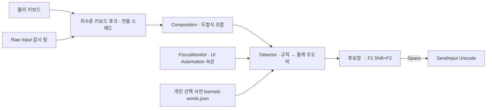

# HanFlow 설계 노트

Windows에서 한/영 모드를 바꾸지 않고 타이핑해도 단어 단위로 한글·영문을 판별해 넣는 **시스템 전역 입력 도우미**의 구조와 결정 근거를 적습니다. 정식 TSF 입력기(IME)가 아닙니다.

## 1. 구성

| 구성 요소 | 파일 | 책임 |
|---|---|---|
| 후크 스레드 | `src/InputController.cs` | `WH_KEYBOARD_LL`·마우스 후크를 UI 스레드와 분리한 전용 스레드에서 설치·펌프. 콜백은 큐에 넣기만 하고 무거운 일은 하지 않음. `Sync` 잠금 안에서 `SendInput`을 부르지 않음 |
| 편집 대상 확인 | `src/FocusMonitor.cs` | 포커스 요소의 UIA 속성(편집 가능·비밀번호·읽기 전용·프로세스 무결성)을 별도 스레드에서 읽고, 창·네이티브 포커스 동일성으로 안전 경계를 판단. 재확인 중에는 대기(Pending) 스냅샷으로 같은 칸의 조합을 이어감 |
| 조합기 | `src/Core.cs` `Hangul` | 두벌식 오토마타(`Compose`/`ToKeys`/`Flip`). 현대 한글 11,172자 왕복 검사 |
| 판별기 | `src/Core.cs` `Detector`·`LanguageScorer` | 아래 2절. 단어 목록 2종(`data/korean-words.txt.gz`·`english-words.txt.gz`)은 보류 구간에서만 참조 |
| 학습 | `src/PreferenceStore.cs` | 직접 바꾸고 확정한 선택만 키열·언어·앞 단어 지문과 함께 저장(최대 1,024항목) |
| 선택 변환 | `src/SelectionReader.cs` | Shift+F2: UIA `TextPattern.GetSelection` → 없으면 태그된 Ctrl+C로 읽고 클립보드 글자 내용 복원 → `Hangul.Flip` → Unicode 입력 |
| 후크 감시 | `src/InputController.cs` `SentinelWindow` | 메시지 전용 창에 `RIDEV_INPUTSINK`로 키보드 Raw Input을 받아, 하드웨어 키-다운이 후크 도장 없이 2회 연속 오면 후크 재설치. 시작 후 후크 호출이 전혀 없는 PC에서는 감시를 해제하고 기존 연결 검사로만 복구(호환모드) |
| 진단 | `src/InputDiagnostics.cs` | `--diagnose-input <경로>`일 때만 원문 없이 앱·입력 방식·문자 종류·차단 사유 순환 기록 |

## 2. 판별 순서

한 단어(공백·구두점 사이의 키열)에 대해 다음 순서로 결정합니다. 앞 규칙이 확정하면 뒤 규칙은 보지 않습니다.

1. **보호**: 주소·경로·식별자·숫자 중심·Shift 대문자 약어는 그대로 둠(Caps Lock 대문자는 소문자 키열로 판별).
2. **개인 선택**: 같은 키열(+같은 앞 단어 지문)의 직접 선택 이력.
3. **영어 어휘**: `data/english.txt`와 간단한 활용형(`-s/-ed/-ing/-ly`), 내장 영어 단어로 나뉘는 식별자(`doWork`).
4. **한국어 손목록·형태**: 자주 쓰는 단어, 명사+조사, 어간+어미 조합. 1음절 손목록 단어는 통계·문맥에 맡김.
5. **통계 우도비**: 같은 키열을 한글 음절 bigram(`P_ko`)과 영문 자모 bigram(`P_en`, 어휘 보너스)으로 점수화해 `llr = log10 P_ko − log10 P_en`. `llr ≥ T`면 한글, `llr ≤ −T`면 영문, 그 사이는 **보류**(원문 유지·후보 제시). 보류 구간에서만 직전 단어의 언어가 ±1.5를 더함.
6. **단어 목록(보류 구간 전용)**: 5단계가 보류한 입력만 본다. 2음절 이상 완전 음절열이 한국어 단어 목록에 있고 우도비가 +1.0 이상이면 한글(신뢰도 "음절 추정"), 3글자 이상 원문이 영어 단어 목록에 있고 한글 읽기가 목록에 없으면 확인 요청 없는 영어. 둘 다 있거나(예: `gown`/해주) 둘 다 없으면 보류 그대로. 1음절은 보지 않는다.
7. **채팅 표현**: 한글 몸통 뒤의 `ㅋㅋ`·`ㅠㅠ` 등은 몸통이 손목록·통계로 한글일 때만 붙임.
8. **혼합어**: 알려진 영단어·한국어 조사·숫자·기호가 섞인 토큰은 최대 64키·8구간의 경로 탐색.

민감도 프리셋은 5단계의 `T`만 바꿉니다: 보수 3.0 · 표준 2.0 · 적극 1.5. 공개 코퍼스 held-out 4,000+4,000 단어에서 보수 3,859/4,000 변환·영문 오변환 1, 표준 3,927·2, 적극 3,958·2였습니다(2026-10-09).

## 3. 교정 경로

| 상황 | 동작 |
|---|---|
| 조합 중 후보가 틀림 | `;` 또는 F2로 후보 전환 → Space 확정 시 선택 기억 |
| Space로 확정한 직후 틀림 | F2로 직전 단어 교체(같은 창·같은 칸·15초 안) |
| 이미 입력된 글자가 틀림 | 글자를 선택하고 Shift+F2로 한↔영 뒤집기(앱의 Ctrl+Z로 되돌림) |
| 특정 앱에서 쓰고 싶지 않음 | 트레이 → 앱별 제외, 또는 F12 일시정지 |

## 4. 알려진 한계와 결정

- **실패-열림 편집기 판정**: Chromium·WebView 편집기는 UIA에 Group·Pane으로 보일 수 있어, Value/Text 패턴이 있으면 편집 칸으로 인정합니다. 비밀번호·읽기 전용·높은 무결성은 여전히 제외합니다.
- **IME가 아니다**: 커서 안 밑줄 조합 대신 별도 조합창을 씁니다. 앱 내부 재변환과는 통합되지 않습니다.
- **Raw Input 호환**: 일부 환경(가상 PC·원격 데스크톱 관측)에서 Raw Input 등록 후 후크 호출이 오지 않는 현상이 있어 자동 호환모드를 두었습니다. 원인은 미확정입니다.
- **통계는 통계다**: 짧은 단어·이름·신조어는 오판할 수 있습니다. 모델은 위키백과 음절 통계라 구어·채팅 어휘와 분포가 다를 수 있습니다.
- **동작하지 않는 곳**: 보안 데스크톱, 관리자 권한 앱(무결성 상위), 게임의 Raw Input 전용 입력, 일부 터미널·웹 편집기.

## 5. 설계 참고

레이아웃 전환기 계열(RuSwitcher·keyboop·PolterType·dotSwitcher·Punto Switcher·xneur)의 수렴 기능(수동 뒤집기·감시·민감도), 문자 n-gram 언어 판별 문헌, Microsoft의 후크·Raw Input 문서를 참고했습니다. 목록과 라이선스는 [REFERENCES.md](REFERENCES.md)에 있습니다.
